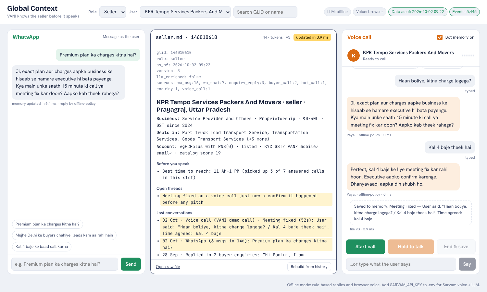

# Global Context — VANI knows the user before it speaks

**Voice AI Hackathon 2.0 · Problem 2: Global Context — Memory Across Channels**

A GLID-keyed memory layer that turns everything a seller or buyer has done on IndiaMART — enquiries, buyer
calls, buy-leads, WhatsApp chats, past VANI calls, executive calls — into a short, structured, always-fresh
`seller.md` / `buyer.md`. VANI loads it before every call or chat, opens with a personal line, and picks up
the conversation where the last channel left it. Every conversation writes back to the same file.

```
WhatsApp ─┐                         ┌─► VANI voice call (Sarvam Bulbul + Saaras + Sarvam-105B)
Enquiries ─┤   events ─► Context   ─┤─► WhatsApp bot
PNS calls ─┼─► store  ─► engine ───►├─► Sales-executive brief / CRM / any service (GET /context/{glid}.md)
Buy-leads ─┤  (SQLite)  (sections, └─► Sarvam Voice Agent (on_start / on_end HTTPS tools)
VANI/Exec ─┘            budget, LLM)        ▲
            ◄──────── call outcome written back ┘
```



## Results on the real hackathon data

| What | Result |
|---|---|
| Files generated | 5,000 `seller.md` + 237 `buyer.md`, **100% schema-valid** |
| Size | median **269 tokens** (seller), **173 tokens** (buyer), hard cap 450 |
| Compression | buyer: **12×** smaller than the raw `getContext` JSON |
| Freshness (replay of 3,000 real events) | event → updated file **p50 6 ms, p95 27 ms** (laptop, SQLite) |
| Correctness | incremental refresh **100% identical** to a full rebuild |
| Resumed without re-asking (60 WhatsApp → voice scenarios) | rule-based bot: memory on **100% pick up the thread, 0% re-ask** vs off 3% / 20% · **real Sarvam-105B + LLM judge (2 runs, 120 calls each): memory on 96.7% pick up the thread, 1.7–5.0% re-ask** vs off 20–32% / 20–23% |
| Privacy | **0 of 5,237 files** quote another party's name (checked against 22,090 buyer names) · 0 phone numbers / emails |
| Cold start | unknown GLIDs get a clean generic file and opener; their first message turns it warm |
| Reuse beyond the bot | executive call-prep brief (`/brief/{glid}`) + WhatsApp-campaign segments (`/api/segments`) read the same files |
| Full rebuild | 5,000 sellers in **13 s** (2.6 ms/seller) |
| Calls that started cold despite fresh activity on another channel | **26.7%** of 9,657 VANI calls |
| Meeting rate when memory says "already called 2+ times this week" | **2.4%** vs 11.2% overall |
| Meeting rate when the seller initiated a thread (WhatsApp question / callback / recent meeting) | **18.3%** |
| Re-routing dial capacity using memory flags | **+18.9% meetings** at the same call volume (estimate) |
| IndiaMART's own personalised-script trial | **+30% meetings per dial** (p = 0.03, 808 vs 396,824 dials) · +22% per answered call (p = 0.09, not significant) |

Full report: [`outputs/eval_full_dataset/eval_report.md`](outputs/eval_full_dataset/eval_report.md).
Sources, lookback window and refresh logic: [`APPROACH.md`](APPROACH.md). Build journey: [`skills.md`](skills.md).

---

## Run it (5 minutes, any laptop)

Needs **Python 3.10+**. Works fully offline; add a Sarvam key for real voices and the Sarvam LLM.

### macOS / Linux
```bash
./run.sh                 # creates .venv, installs, builds all files, starts http://localhost:8000
```

### Windows (PowerShell or cmd)
```bat
run.bat
```

### Manual (any OS)
```bash
python -m venv .venv
source .venv/bin/activate            # Windows: .venv\Scripts\activate
pip install -r requirements.txt
python -m gcx setup                  # ingest data/demo + build every seller.md / buyer.md (~1 s)
python -m gcx serve                  # open http://localhost:8000
```

### Docker
```bash
docker compose up --build            # http://localhost:8000
```

### Turn on Sarvam (voice + LLM)
```bash
cp .env.example .env                 # then paste your key: SARVAM_API_KEY=sk_...
```
Restart the server. The header chips switch to **LLM: Sarvam-105B** and **Voice: Bulbul + Saaras**.
Without a key, the demo uses a rule-based dialogue policy and the browser's own speech (Chrome/Edge recommended).

**Voice latency with Sarvam (measured, laptop on home Wi-Fi):**

| Step | Time |
|---|---|
| Opening line + Bulbul audio when "Start call" is pressed | **~35 ms**: pre-generated in the background as soon as the user is opened or their file changes |
| Sarvam-105B reply | 0.7–1.0 s |
| User stops speaking → Payal's voice starts | **~2.4 s median**: reply text shows at once; audio is synthesised as a short head phrase + the rest in parallel, and the head plays first |
| Speech-to-text (Saaras v4, codemix) | 0.6–0.8 s |

**Rate limits:** the Starter plan allows sarvam-105b 40 requests/min and bulbul:v3 30/min. The client keeps a local
requests-per-minute budget a little under those numbers. It uses at most 2 TTS requests per reply, and it skips
optional background work (AI polish, opener pre-warm) when quota is low. A 429 never breaks a call: that one turn falls
back to the browser voice. Evaluation jobs run in batch mode (they wait for quota instead of falling back). Raise
`sarvam.llm_rpm` / `tts_rpm` in `config.yaml` on a bigger plan.

---

## The demo (what to click)

1. **Pick a seller** — e.g. *KPR Tempo Services* (open WhatsApp question + earlier meeting).
   The middle pane is the live `seller.md` the bot will load.
2. **WhatsApp pane:** send “Premium plan ka charges kitna hai?”.
   The file updates in milliseconds — changed lines glow, the stamp shows the refresh time.
3. **Voice pane → Start call.** Payal opens with:
   *“…aapne abhi thodi der pehle WhatsApp par poochha tha — ‘Premium plan ka charges kitna hai?’ — usi ke baare mein…”*
   Untick **Bot memory on** and call again to hear today's cold script for comparison.
4. **Talk** (hold the mic button) or type: “Kal 4 baje theek hai”. Then **End & save** — the outcome is
   summarised and written back; the WhatsApp thread closes, the meeting appears under *Open threads*.
5. Back on **WhatsApp**: the next reply already knows about the call. That's a conversation resumed across two channels.
6. Switch the chat pane from **WhatsApp** to **App chat** or **Web chat** and type “Kal subah 11 baje call karna” —
   the file labels it *App chat*, and the next call opens with “Aapne IndiaMART app par kal subah 11 baje call karne ko kaha tha…”.

Cold start: pick **New contact (no history)** — the file and opener are generic; send one WhatsApp message and call
again to see it turn warm. More scenarios: *Khodal Industries* (asked not to be called + wrong number + speaks Gujarati → opener
switches language with Sarvam), *Ziptron Enterprise* (called 3× this week → short, apologetic opener),
*Agrim Wholesale* (asked for a callback, unread enquiries, buyer waiting). Switch **Role → Buyer** for `buyer.md`
built from the `getContext` API (e.g. *Abhishek* — spoke to two sellers yesterday about PVC pipe scrap).

## Command line

```bash
python -m gcx setup [--data DIR]       # ingest + build everything
python -m gcx build --glid 146010610   # print one file (+ tokens, build time)
python -m gcx event 146010610 wa_chat "ECS plan ka rate kya hai?"   # live event → refreshed file + ms
python -m gcx eval                     # evaluation → outputs/eval_report.{md,json}
python -m gcx resume-eval              # WhatsApp → voice resumption benchmark, memory on vs off
python -m gcx segments                 # campaign segments from the .md files → outputs/segments.csv
python -m gcx brief 146010610          # executive call-prep page → outputs/briefs/146010610.html
python -m gcx serve --port 8000
python -m pytest -q                    # tests
```

### Use the full hackathon data
Put the original folders anywhere (e.g. `data/raw/`) — the loader finds the `gc_*.csv` seller files and the buyer
`getContext` CSV export recursively:
```bash
python -m gcx setup --data data/raw
GCX_DATA_DIR=data/raw python -m gcx eval
python scripts/personalised_trial.py --persona "data/raw/Persona Files" --btc "data/raw/BesTime to Call"
```

## API (reusable beyond the bot)

| Method | Path | Purpose |
|---|---|---|
| GET | `/context/{glid}.md` | The file, `text/markdown` — what any bot/agent loads |
| GET | `/api/context/{glid}` | JSON: md, version, tokens, structured sections |
| POST | `/api/chat` | `{glid, text, channel}` — channel `wa_chat` / `app_chat` / `web_chat`; writes to the same file, returns reply + `freshness_ms` (`/api/whatsapp` is an alias) |
| POST | `/api/events` | `{glid, channel, kind, text, meta}` → incremental refresh, returns new file + `freshness_ms` |
| GET | `/api/stream` | Server-sent events: every file update, live |
| GET | `/api/metrics` | Freshness p50/p95, Sarvam latency |
| GET | `/brief/{glid}` | **Non-bot use:** printable executive call-prep brief rendered from the file |
| GET | `/api/segments[?format=csv]` | **Non-bot use:** WhatsApp-campaign / dialer segments computed from the files |
| GET | `/sarvam/context?glid=` | **Sarvam Voice Agent `on_start` tool**: context + opening line + language |
| POST | `/sarvam/call-ended` | **Sarvam Voice Agent `on_end` tool**: transcript/summary written back |

Interactive docs at `http://localhost:8000/docs`. Connecting a Sarvam Voice Agent: [`sarvam_agent/README.md`](sarvam_agent/README.md).

## Project layout

```
gcx/            engine: ingest.py · store.py · seller_sections.py · buyer_sections.py · render.py
                engine.py (refresh + LLM enrichment) · agent.py (voice/WhatsApp) · sarvam.py · api.py · evaluate.py
web/            demo UI (vanilla JS, no build step, fonts bundled — runs offline)
data/demo/      67 sellers + 237 buyers sliced from the hackathon data (phones/emails masked)
outputs/        generated seller_md/, buyer_md/, eval reports (demo + full dataset)
sarvam_agent/   prompt + tool config for a Sarvam Voice Agent
tests/          pytest suite
```

## Troubleshooting

| Symptom | Fix |
|---|---|
| `Store is empty` | run `python -m gcx setup` |
| Port busy | `python -m gcx serve --port 8010` |
| No voice in offline mode | use Chrome/Edge; Safari/Firefox lack Hindi browser voices — or add the Sarvam key |
| Mic button disabled | offline mode needs Chrome's speech recognition; with a Sarvam key any browser works (allow mic) |
| Sarvam errors | the footer shows the last error; `GET /api/status` → `modes.last_error`. The demo keeps working offline |

Data note: the dataset contains real business names; it stays on IndiaMART machines per the hackathon rules.
Demo data masks phone numbers and emails.
